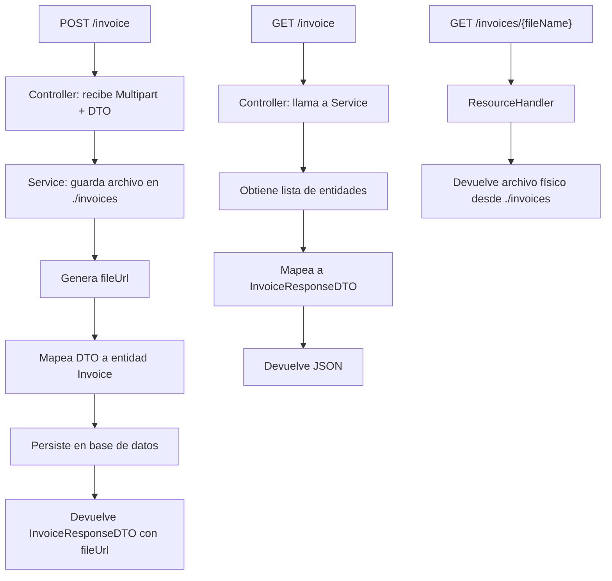

# 📄 Invoices API – Spring Boot

API REST para gestión de *Invoices* con soporte de subida de archivos y acceso público a los mismos.

---

## 🚀 Tecnologías
- Java 17
- Spring Boot 3.5.5
- PostgreSQL
- Lombok
- Docker & Docker Compose

---

## 🗺 Diagrama del flujo de la API


## 🧪 Ejecutar la API y los tests

Este proyecto usa `docker-compose` con contenedores separados para:

- `springboot-app`: la aplicación Spring Boot compilada.
- `postgres-db`: base de datos PostgreSQL.

### ✅ Requisitos
- Docker

---

### 🪟 Windows (por defecto)

Docker Desktop ya configura automáticamente el socket de Docker en Windows.
Simplemente ejecuta:

```powershell
docker compose up --build
```

### 🐧 Linux / 🍎 MacOS

```powershell
DOCKER_SOCKET=/var/run/docker.sock docker compose up --build
```